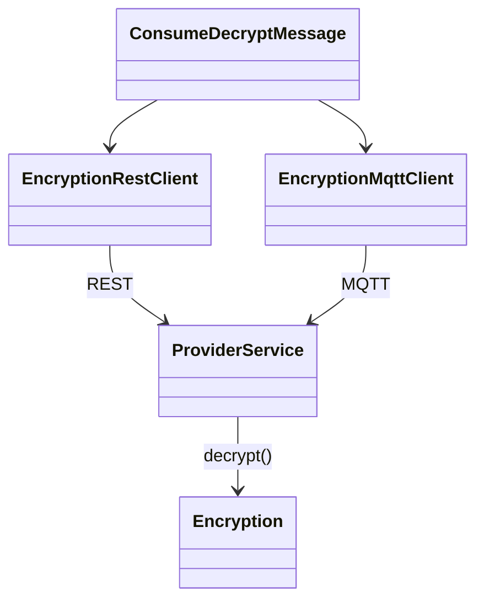

# Consume Encryption Capability

## MQTT contract

| Purpose | Topic |
| --- | --- |
| Decrypt request | `csc5100/encryption/decrypt/request` |
| Decrypt response | `csc5100/encryption/decrypt/response` |

The consumer sends this JSON request:

```json
{
  "requestId": "unique-id",
  "encryptedMessage": "Base64 encrypted text"
}
```

The provider returns this JSON response:

```json
{
  "requestId": "unique-id",
  "success": true,
  "data": "decrypted plaintext",
  "error": null
}
```

## UML



## Test cases

| Test | Expected result |
| --- | --- |
| Valid encrypted Base64 input | Provider returns the original plaintext. |
| Invalid Base64 input | Provider returns an error response; consumer prints the error. |
| Altered encrypted text | Provider returns a decryption error; consumer does not crash. |
| REST provider unavailable | REST client reports a communication error. |
| Malformed REST JSON response | REST client reports a response-parsing error. |
| MQTT response timeout | MQTT client reports a timeout after 10 seconds. |